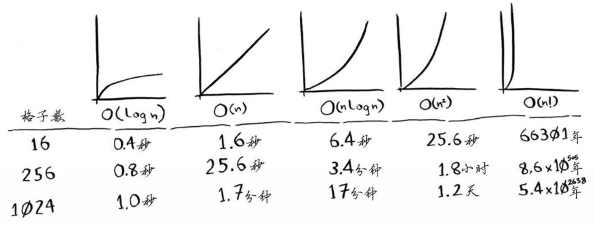

##第一章 二分查找  
二分查找的输入必须是有序链表。使用二分查找时，最多需要检查logn个元素，因为2的n次方为元素个数。  
可将元素存储在一系列相邻的桶中。  
```python
def binary_search(list, item):
  low = 0
  high = len(list)-1
  
  while low<=high:
  mid = (low+high)/2
  guess = list[mid]
  if guess == item:
    return mid
  if guess>item:
    high = mid-1
  else:
    low = mid+1
  return None
```
二分查找和简单查找的运行时间的增速不同。即算法的速度指的并非时间，而是操作的增速。  
除了知道算法需要多长时间才能运行完，还需要知道运行时间如何随列表增长而增加。  

大O表示法指出的是最糟情况下的运行时间。常见：  
O(logn)对数时间，如二分查找；  
O(n)线性时间，如简单查找；  
O(nlogn)如快速排序（第四章），一种速度较快的排序算法；  
O(n的平方)如选择排序（第二章），一种速度较慢的排序方法；  
O(n!)如旅行商问题的解决方案，一种非常慢的算法。  

##第二章 数组和链表  
很多算法仅在数据进行排序后才管用。  
fe0ffeeb是一个内存单元的地址。需要存储多项数据时，有两种基本方式：数组和链表。  
在数组中添加新元素很麻烦，如果没有了空间，就需要移到内存的其他地方，因此添加新元素的速度会变慢。一种解决方案是“预留座位”；另一种是使用链表。  
链表优势：**插入元素**。  
链表存在的问题：每次需要读取链表的最后一个元素时，不能直接读取，因为不知道其所处位置。  
需要随机读取元素时，数组的效率很高，因为可以迅速找到数组的任何元素。  
| 数组 | 链表 |
|--- | --- | --- |
| 读取 | O(1) | O(n) |
| 插入 | O(n) | O(1) |

##第三章 递归  
##第四章 问题解决技巧：分而治之  
##第九章 问题解决技巧：动态规划  
如果没有高效的解决方案，使用：  
##第八章 贪婪算法  

当需要解决问题时，首先想到是否可以用散列表或用图来建立模型。  
##第五章 散列表  
##第六章 图算法：广度优先搜索  
##第七章 图算法：迪克斯特拉算法  

简单的机器学习算法：  
##第十章 KNN算法  
可用于创建推荐系统、OCR引擎、预测股价或其他值，或对物件进行分类。  
