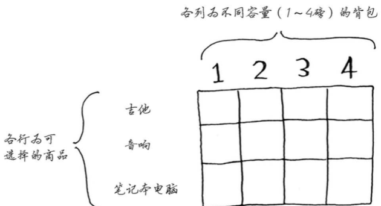
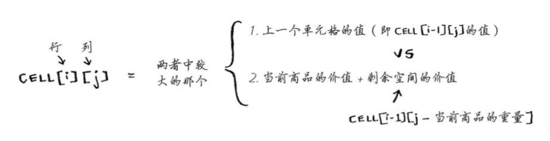
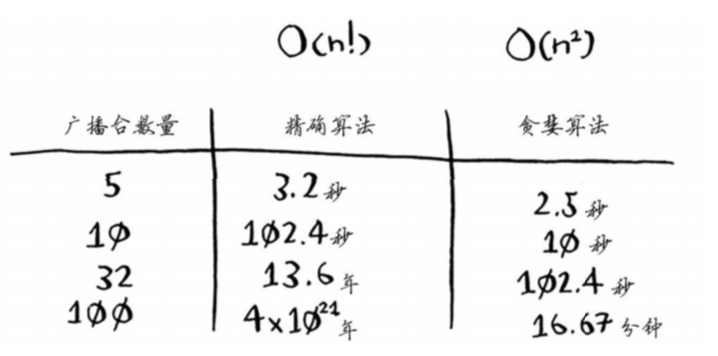
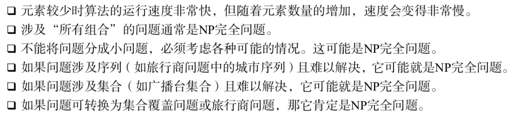
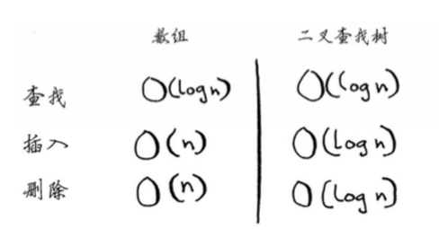

## 第一章 二分查找  
二分查找的输入必须是有序链表。使用二分查找时，最多需要检查logn个元素，因为2的n次方为元素个数。  
可将元素存储在一系列相邻的桶中。  
```python
def binary_search(list, item):
  low = 0
  high = len(list)-1
  
  while low<=high:
  mid = (low+high)/2
  guess = list[mid]
  if guess == item:
    return mid
  if guess>item:
    high = mid-1
  else:
    low = mid+1
  return None
```
二分查找和简单查找的运行时间的增速不同。即算法的速度指的并非时间，而是操作的增速。  
除了知道算法需要多长时间才能运行完，还需要知道运行时间如何随列表增长而增加。  

大O表示法指出的是最糟情况下的运行时间。常见：  
O(logn)对数时间，如二分查找；  
O(n)线性时间，如简单查找；  
O(nlogn)如快速排序（第四章），一种速度较快的排序算法；  
O(n的平方)如选择排序（第二章），一种速度较慢的排序方法；  
O(n!)如旅行商问题的解决方案，一种非常慢的算法。  

## 第二章 数组和链表  
很多算法仅在数据进行排序后才管用。  
fe0ffeeb是一个内存单元的地址。需要存储多项数据时，有两种基本方式：数组和链表。  
在数组中添加新元素很麻烦，如果没有了空间，就需要移到内存的其他地方，因此添加新元素的速度会变慢。一种解决方案是“预留座位”；另一种是使用链表。  
链表优势：**插入元素**。  
链表存在的问题：每次需要读取链表的最后一个元素时，不能直接读取，因为不知道其所处位置。  
需要随机读取元素时，数组的效率很高，因为可以迅速找到数组的任何元素。  
如果内存中没有足够的空间，插入操作可能失败，但是任何情况下都能够将元素删除。  
| | 数组 | 链表 |
|:---: | :---: | :---: |
| 读取 | O(1) | O(n) |
| 插入 | O(n) | O(1) |
| 删除 | O(n) | O(1) |  

仅当能够立即访问要删除的元素时，删除操作的运行时间才为O(1).因为通常需要删除的是链表的第一个和最后一个元素。  
数组访问方式：随机访问和顺序访问。链表只能顺序访问。很多情况要求能够随机访问，因此数组用的很多。  
选择排序O(n的平方).  
```python
def findSmallest(arr):
  smallest = arr[0]
  smallest_index = 0
  for i in range(1, len(arr)):
    if arr[i] < smallest:
      smallest = arr[i]
      smallest_index = i
  return smallest_index
  
def selectionSort(arr):
  newArr = []
  for i in range(len(arr)):
    smallest = findSmallest(arr)
    newArr.append(arr.pop(smallest))
return newArr
```
快速排序O(nlogn).  
链表的元素是分开的，其中每个元素都存储了下一个元素的地址。  
同一个数组中，所有元素的类型必须相同。  

## 第三章 递归  
本章多使用伪代码。  
第一种方法使用while循环，只要盒子堆不空，就从中取一个盒子，并在其中仔细查找。  
```python
def look_for_key(main_box):
  pile = main_box.make_a_pile_to_look_through()
  while pile is not empty:
    box = pile.grab_a_box()
    for item in box:
      if item.is_a_box():
        pile.append(item)
      elif item.is_a_key():
        print "found the key"
```
第二种方法使用递归，即函数调用自己。  
```python
def look_for_key(box):
  for item in box:
    if item.is_a_box():
      look_for_key(item)
    elif item.is_a_key():
      print "found the key"
```
递归函数调用自己，编写时很容易出错导致无限循环。编写时需要告诉它何时停止递归，每个递归函数都有两部分：**基线条件base case和递归条件recursive case**。递归条件指函数调用自己，基线条件指函数不再调用自己。  
调用栈call stack只有两种操作：压入（插入）和弹出（删除并读取）。  
计算阶乘的递归函数：  
```python
def fact(x):
  if x == 1:
    return 1
  else:
    return x * fact(x-1)
```
栈包括未完成的函数调用，每个函数调用都包含着未检查完的盒子。  

## 第四章 问题解决技巧：分而治之  
快速排序使用分而治之divide and conquer(D&C)的策略。  
使用D&C解决问题一般包括两个步骤：  
（1）找出基线条件，尽可能简单；  
（2）不断将问题分解/缩小规模，直到找到符合基线条件。  
编写涉及数组的递归函数时，基线条件通常是数组为空或只包含一个元素。（以选择排序为例）在这种情况下，只需要原样返回数组、不用排序：  
```python
def quicksort(array):
  if len(array) < 2:
    return array
```
快速排序的工作原理：首先在数组中选一个元素，这个元素被称为基准值（pivot），暂时将数组的第一个元素作为基准值。接下来找比基准值小、大的元素，被称为分区。  
分区后得到的两个数组是无序的，再对子数组进行快速排序、合并结果就可以得到一个有序数组。  
```python
def quicksort(array):
  if len(array) < 2:
    return array
  else:
    pivot = array[0]
    less = [i for i in array[1:] if i <= pivot]
    greater = [i for i in array[1:] if i > pivot]
    return quicksort(less)+[pivot]+quicksort(greater)
  print quicksort([10,5,2,3])
```
快速排序在最糟糕情况下运行时间为O(n的平方)，平均情况下为O(nlogn).  
常量的影响对快速查找和合并查找都很大，这也是快速排序比合并排序快的原因。  
快速排序的性能高度依赖于所选择的基准值。最佳情况下，调用栈的高度为O(logn)，每层需要的时间为O(n)，因此整个算法需要的时间为O(n)\*O(logn)=O(nlogn).  

## 第九章 问题解决技巧：动态规划  
如果没有高效的解决方案，使用贪婪算法（第八章）。  
动态规划是将问题分成小问题，并先着手解决这些小问题。  
每个动态规划算法都从一个网格开始：  
  
网格最初是空的，当网格填满后，就找到了问题的答案。  
计算小背包可装入的商品的最大价值的原因 -- 余下了空间时，可根据这些子问题的答案来确定余下的空间可装入哪些商品。  
  
  
使用这个公式来计算每个单元格的价值，最终的网格将与前一个网格相同。  
各行的排列顺序无关紧要。  
使用动态规划时，要么考虑拿走整件商品，要么考虑不拿，没法判断该不该拿走商品的一部分。但贪婪算法可以轻松地处理这种情况。  
注意：仅当每个子问题都是离散的，即不依赖于其他子问题时，动态规划才管用。  
  
确定解决问题的网格：
1.单元格中的值  
2.如何将这个问题划分为子问题  
3.网格的坐标轴  
  
例子：寻找最长公共子串  
实现公式的伪代码：  
```python
if word_a[i] == word_b[j]:
  cell[i][j] = cell[i-1][j-1] + 1
else:
  cell[i][j] = 0
```
对于这个问题，这个问题的最终答案不在最后一个单元格中；而背包问题最终答案总是在最后的单元格中。  
  
例子：寻找最长公共子序列  
```python
if word_a[i] == word_b[j]:
  cell[i][j] = cell[i-1][j-1] + 1
else:
  cell[i][j] = max(cell[i-1][j], cell[i][j-1])
```
应用：编辑距离levenshtein distance指出了两个字符串的相似程度，也是使用动态规划计算得到的。  
  
## 第八章 贪婪算法  
贪婪算法的优点 -- 简单易行，每步都选择最优的做法  
常见：背包问题。  
例子：  
找出覆盖50个州的最小广播台集合：  
（1）列出每个**可能的广播台集合**，即幂集power set，可能的子集有2的n次方个。运行时间为O(2的n次方)。  
（2）在这些集合中，选出覆盖50个州的最小集合。  
使用**近似算法approximation algorithm**可以得到与贪婪算法接近的解。  
```python
#1.准备工作
states_needed = set(["mt", "wa", "or", "id", "nv", "ut", "ca", "az"])
stations = {}
stations["kone"] = set(["id", "nv", "ut"])
stations["ktwo"] = set(["wa", "id", "mt"])
stations["kthree"] = set(["or", "nv", "ca"])
stations["kfour"] = set(["nv", "ut"])
stations["kfive"] = set(["ca", "az"]) #键为广播台的名称，值为广播台覆盖的州
final_stations = set() #存储最终选择的广播台

#2.计算答案
while states_needed: #循环直到states_needed为空
#正确的解可能有多个，需要遍历所有的广播台，从中选择覆盖了最多的未覆盖州的广播台
  best_station = None
  states_covered = set()  #集合，包含该广播台覆盖的所有未覆盖的州
  for station, states_for_station in stations.items():
    covered = states_needed & states_for_station #计算交集；交集类似于列表，只是不能包含重复的元素；covered包含当前广播台覆盖的一系列还未覆盖的州
    if len(covered) > len(states_covered):
      best_station = station
      states_covered = covered
states.needed -= states_covered #由于该广播台覆盖了一些州，因此不用再覆盖这些州
final_stations.add(best_station) #在for循环结束后将best_station添加到最终的广播台列表中

print(final_stations)
```
  

例子：旅行商问题  
阶乘函数factorial function：5!=120  
旅行商问题和集合覆盖问题有一些共同之处：需要计算所有的解，并从中选出最小/最短的那个。  
  
例子：使用近似算法组建球队  
（1）找出符合最多要求的球员。  
（2）不断重复这个过程，直到球队满足要求/球队名额已满。  
  
  
面临NP完全问题时，最佳的做法是使用近似算法；贪婪算法易于实现，运行速度快，是不错的近似算法。  
  
当需要解决问题时，首先想到是否可以用散列表或用图来建立模型。  
## 第五章 散列表  
如果本子内容是按字母顺序排序的（即有序列表），就可以使用二分查找来找出苹果的价格。  
散列函数“将输入映射到数字”。  
数组和链表都被直接映射到内存，但散列表hash table使用散列函数来确定元素的存储位置。hash table也被称为散列映射、映射、字典和关联数组。Python的散列表实现为字典，可以用dict来创建散列表。  
应用有：将散列表用于查找、防止重复、用作缓存。  
防止重复：  
```python
voted = {}
def check_voter(name):
  if voted.get(name):
    print "kick them out"
  else:
    voted(name) = True
    print "let them vote"
```
缓存：仅当URL不在缓存中时，才让服务器做处理，并将处理生成的数据存储到缓存中，再返回。  
```python
cache = {}
def get_page(url):
  if cache.get(url):
    return cache[url]
  else:
    data = get_data_from_server(url)
    cache[url] = data
    return data
```
处理冲突collision：如果两个键映射到了同一位置，就在这个位置存储一个链表。  
散列表的性能：(分别在平均情况和最糟情况下)  
| 查找 | O(1) | O(n) |
|:---: | :---: | :---: |
| 插入 | O(1) | O(n) |
| 删除 | O(1) | O(n) |  

如何实现散列表略。  

## 第六章 图算法：广度优先搜索  
解决最短路径问题的算法被称为广度优先搜索breadth-first search, BFS.如前往朋友家的最短路径，或国际象棋中把对手将死的最少步数。一般需要两个步骤：  
（1）使用图来建立问题模型；  
（2）使用广度优先搜索解决问题。  
BFS是一种基于图的查找算法。实现按照添加顺序进行检查的数据结构：队列queue.只支持入队和出队两种操作。  
使用散列表：将节点映射到所有邻居。表示映射关系：  
```python
graph = {}
graph["you"] = {"alice", "bob", "claire"}
```
散列表是无序的，添加键值对的顺序无关紧要。  
```python
from collection import deque  #使用函数deque来创建一个双端队列
search_queue = deque()
search_queue += graph["you"]  #将所有邻居加入到这个搜索队列中

while search_queue:
  person = search_queue.popleft()
  if person_is_seller(person):
    print person+"is a mango seller"
    return True
  else:
    search_queue += graph[person]
return False
```
另外，检查完一个人后，应将其标记为检查，不然会导致无限循环。最终代码：  
```python
def search(name):
  search_queue = deque()
  search_queue += graph[name]
  searched = []
  while search_queue:
    person = search_queue.popleft()
    if not person in searched:
      if person_is_seller(person):
        print person+"is a mango seller"
        return True
      else:
        search_queue += graph[person]
        searched.append(person)
  return False
```
BFS运行时间O(V+E)，V为顶点vertice数即人数，E为边数edge.  

## 第七章 图算法：迪克斯特拉算法  
找最快的路径——Dijkstra's algorithm：  
（1）找出“最便宜”的节点，即可在最短时间内到达的节点；  
（2）更新该节点的邻居的开销；  
（3）重复该过程，知道遍历完图中所有的节点；  
（4）计算最终路径。  
在迪克斯特拉算法中，给每段都分配了一个数字或权重，因此迪克斯特拉算法找出的是总权重最小的路径。  
迪克斯特拉算法只适用于有向无环图directed acyclic graph DAG.  
例子：  
准备工作：创建一个表格，在其中列出每个节点的开销，开销指达到节点需要额外支付多少钱。  
执行算法过程中，表格不断更新。  
算法关键理念：找出图中最便宜的节点，并确保没有到该节点的更便宜的路径。  
如果有负权边，就不能用迪克斯特拉算法。因为这个算法的假设是，对于没有处理过的海报节点，没有前往该节点的更短路径。此时用另一种算法——贝尔曼-福德算法。  
迪克斯特拉算法的代码实现：  
首先需要三个散列表graph costs parents，随着算法的进行，后两个列表将不断更新。  
```python
graph = {}
graph["you"] = ["alice", "bob", "claire"]  #将节点的所有邻居都存储在散列表中
graph["start"] = {}
graph["start"]["a"] = 6
graph["start"]["b"] = 2  #表示这些边的权重
#如果要获取起点start的所有邻居，可以：print(graph["start"].keys()) 可以得出["a", "b"]
#如果要获知从起点start到A的边的权重，可以：print(graph["start"]["a"]) 可以得到2

#接下来创建开销表，对于不知道的开销，将其设为无穷大
infinity = float("inf")
costs = {}
costs["a"] = 6
costs["b"] = 2
costs["fin"] = infinity

#还需要一个存储父节点的散列表
parents = {}
parents["a"] = "start"
parents["b"] = "start"
parents["fin"] = None

#最后需要一个数组，用于记录处理过的节点
processed = {}

node = find_lowest_cost_node(costs) #找出开销最小的节点
while node is not None: #处理所有节点
  cost = costs[node]
  neighbors = graph[node]
  for n in neighbors.keys(): #遍历当前所有节点的邻居
    new_cost = cost + neighbors[n]
    if costs[n] > new_cost: #如果经当前节点前往该邻居更近，就更新该邻居的开销；同时将该邻居的父节点标记为处理过
      costs[n] = new_cost
      parents[n] = node
  processsed.append(node)
  node = find_lowest_cost_node(costs) #找出接下来要处理的节点并循环
  
def find_lowest_cost_node(costs):
  lowest_cost = float("inf")
  lowest_cost_node = None
  for node in costs:
    cost = costs[node]
    if cost < lowest_cost and node not in processed:
      lowest_cost = cost
      lowest_cost_node = node
  return lowest_cost_node
```
广度优先搜索 -- 非加权图  
迪克斯特拉算法（权重为正） -- 加权图  
贝尔曼-福德算法（权重为负） -- 加权图  

简单的机器学习算法：  
## 第十章 KNN算法  
可用于创建推荐系统、OCR引擎、预测股价或其他值，或对物件进行分类。  
OCR optical character recognition 光学字符识别：  
（1）浏览大量的数字图像，将这些数字的特征提取出来；  
（2）遇到新图像时，提取该图像的特征，再找出它最近的邻居都是谁。  
一般而言，OCR算法提取线段、点和曲线等特征。  
OCR的第一步是查看大量的数字图像并提取特征，这被称为训练training. 大多数机器学习算法都包含训练的步骤：要让计算机完成任务，必须先训练它。  
  
例子：垃圾邮件过滤器 使用一种简单算法——朴素贝叶斯分类器Naive Bayes classifier  
  
  
## 第十一章 接下来如何做  
未介绍的10种算法  
1.树  
...如果能将用户名插入到数组的正确位置就好了，这样就无需在插入后再排序——二叉搜索树binary search tree  
对于其中的每个节点，左子节点的值都比它小，而右子节点的值都比它大。  
  
B树是一种特殊的二叉树，数据库常用它来存储数据。  
相关：B树，红黑树，堆，伸展树。  
2.反向索引  
一个散列表，将单词映射到包含它的页面，这种数据结构被称为反向索引inverted index，常用于创建搜索引擎。  
  
